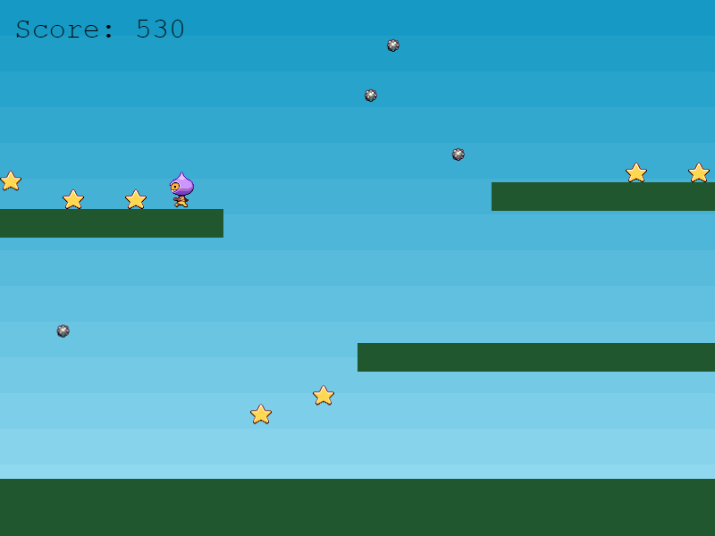

# Part 10 - Bouncing Bombs

[Example Code](example-code/part-10.js)

In order to round our game out it's time to add some baddies. This will give a nice element of challenge to the game, something that was previously missing.

The idea is this: When you collect all the stars the first time it will release a bouncing bomb. The bomb will just randomly bounce around the level and if you collide with it, you die. All of the stars will re-spawn so you can collect them again, and if you do, it will release another bomb. This will give the player a challenge: get as high a score as possible without dying.

The first thing we need is a Group for the bombs and a couple of Colliders:

```
this.bombs = this.physics.add.group();

this.physics.add.collider(this.bombs, this.platforms);
this.physics.add.collider(this.player, this.bombs, this.hitBomb, null, this);
```

The bombs will of course bounce off the platforms, and if the player hits them we'll call the `hitBomb` method. All that will do is stop the game and turn the player red:

```
hitBomb(player, bomb) {
  this.physics.pause();

  player.setTint(0xff0000);

  player.anims.play('turn');
}
```

So far, so good, but we need to release a bomb. To do that we modify the `collectStar` method:

```
collectStar(player, star) {
  star.disableBody(true, true);

  this.score += 10;
  this.scoreText.setText('Score: ' + this.score);

  if (this.stars.countActive(true) === 0) {
    this.stars.children.iterate((child) => {
      child.enableBody(true, child.x, 0, true, true);
    });

    const x = (player.x < 400) ? Phaser.Math.Between(400, 800) : Phaser.Math.Between(0, 400);
    const bomb = this.bombs.create(x, 16, 'bomb');

    bomb.setBounce(1);
    bomb.setCollideWorldBounds(true);
    bomb.setVelocity(Phaser.Math.Between(-200, 200), 20);
  }
}
```

We use a Group method called `countActive` to see how many stars are left alive. If it's none then the player has collected them all, so we use the iterate function to re-enable all of the stars and reset their y position to zero. This will make all of the stars drop from the top of the screen again.

The next part of the code creates a bomb. First we pick a random x coordinate for it, always on the opposite side of the screen to the player, just to give them a chance. Then the bomb is created, it's set to collide with the world, bounce and have a random velocity.

The end result is a nice little bomb sprite that rebounds around the screen. Small enough to be easy to avoid, at the start, but as soon as the numbers build up it becomes a lot harder!



And our game is done 🎉

## Conclusion

You have now learned how to create a sprite with physics properties, to control its motion and to make it interact with other objects in a small game world. There are lots more things you can do to enhance this. Why not expand the size of the level and allow the camera to scroll? Maybe add in different baddie types, different value pick-ups, or give the player a health bar.

Or for a non-violent style game you could make it a speed-run and simply challenge them to collect the stars as quickly as possible.

With the help of what you have learned in this tutorial and the hundreds of examples available to you, you should now have a solid foundation for a future project. But as always if you have questions, need advice or want to share what you've been working on then feel free to ask for help in the Phaser forum.

## Facebook Instant Games

Phaser 3 has full support for creating Facebook Instant Games. Now that you've learned how to create a Phaser game, why not see how easy it is to convert it into an Instant Game in this dedicated [Getting Started Guide](https://phaser.io/tutorials/getting-started-facebook-instant-games).

[Back](part-9.md)